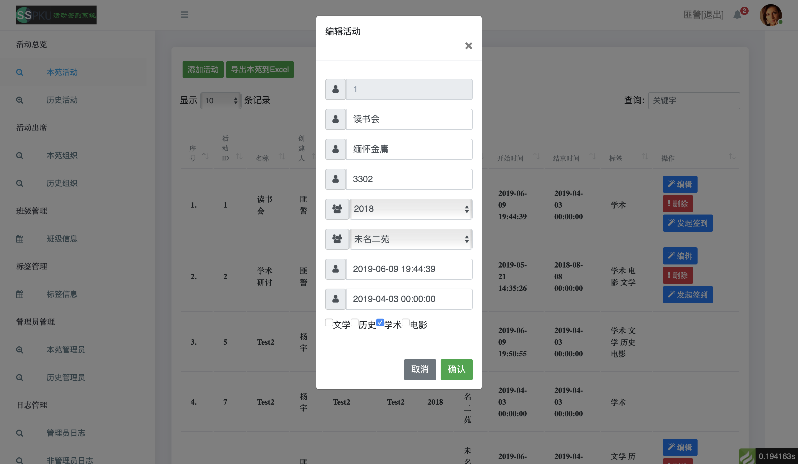
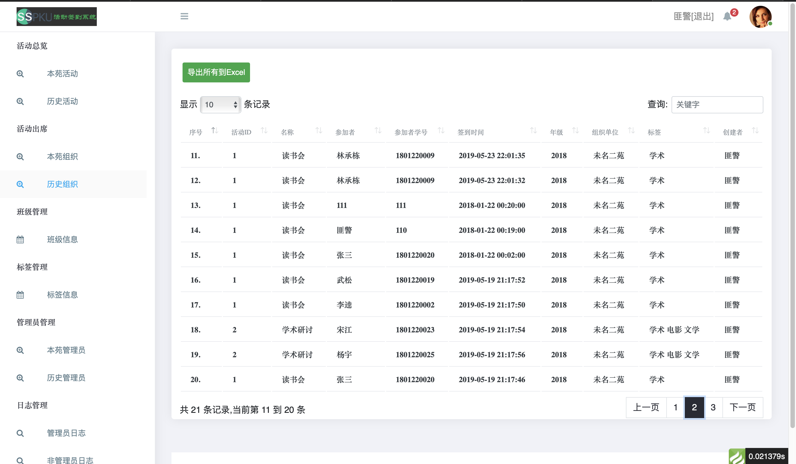
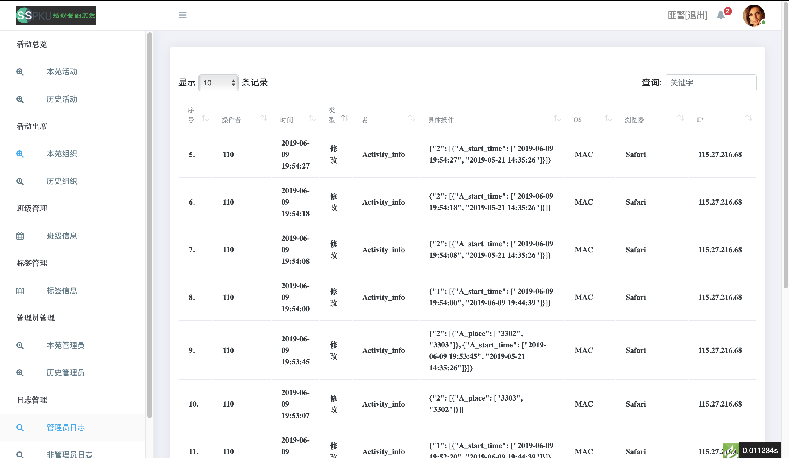

[基于LAMP实现后台活动发布和前端扫码签到系统]()


## 目的

无论是公司、学校和社会团体，都会举办各式各样的活动，比如运动会、部门会议、项目会议、野炊、团建等。作为团队管理者来讲，当然希望能够把这类活动转移到线上形成完整的系统，类似于电子流的形式。本文以学院组织的所有活动为例，实现一个这样的系统。

## 群体

学院由很多班级组成，每个班级由班干部（如班长、团支书等，视为二级管理员）和非班干部（视为普通成员），同时学院之下有很多老师（统称为教职工，视为一级管理员）。

## 期望需求

我们希望开发一个这样的系系统：
1. 一级和二级管理员能够在系统内创建活动，并能够记录活动详细信息（如活动名称、活动内容、活动创建人、活动开始时间、活动结束时间、活动开展地点、活动类型等）；
2. 创建活动时可以为本活动选择活动标签，标签记录了属于什么类型的活动，比如德育、体育、学术等；
3. 对于每一项活动，都有一个发布签到的功能，会生成一个二维码，二级管理员和普通成员通过微信扫描二维码就能将自己的出席信息记录到系统中；
4. 二级管理员发布签到时仅能够发布那些由其本人创建的活动，一级管理员发布签到时能够发布全部活动；
6. 提供导出活动列表的功能，二级管理员仅能导出本班创建的所有活动，一级管理员能够导出所有活动；
3.	提供导出活动出席名单的功能，二级管理员仅能导出由其本班组织的活动的活动出席名单，一级管理员能够导出所有活动的活动出席名单；
4.	提供导入活动出席名单的功能，二级管理员和一级管理员都可以导入所有活动的活动出席名单，前提是该活动在系统中已经存在；
5.	不提供管理员注册接口，所有的一级管理员账户均由admin（超管账户）创建，一级管理员可以创建二级管理员账户，admin可以修改所有账户信息，除此之外，所有管理员账户都不能对其他账户进行修改；
6.	管理员忘记账户密码后，可以通过手机重置密码；
7.	系统中需要能够记录所有账户的日志信息（登陆、添加、修改、删除、导入、导出）；
11. 二级管理员和普通成员通过微信端需要能够查看自己历史以来参加了哪些活动。

综上，可以总结出，这样的一个系统主要功能都集中在后端，前端只是实现一个简单的扫码签到功能和活动查询展示功能。

## Mysql数据库&数据表设计

过完前面的需求，一个大致的Mysql数据库设计方案在脑海里就已经形成了，我们建立一个数据库名为：activity_sign_system，在该数据库下建立如下数据表：

### manage_info

管理员表，存储所有管理员信息。

| 字段名        | 字段类型     | 备注信息   | 字段含义                           |
| ------------- | ------------ | ---------- | ---------------------------------- |
| m_id          | int(11)      | 自增       | 自增编号                           |
| m_number      | int(11)      | 非空       | PK，学号或教职工号                 |
| m_name        | varchar(30)  | 非空       | 管理员姓名                         |
| m_class_id    | int(11)      | 非空       | 管理员所在班级                     |
| m_grade       | tinyint(4)   | 非空       | 学生入学年份/教职工入校年份        |
| m_rivilege    | tinyint(1)   | 非空       | 1:超管；2:一级管理员；3:二级管理员 |
| m_salt        | char(256)    | 非空       | 盐值随机数                         |
| m_password    | varchar(512) | 非空       | sha256(m_salt+sha256(用户密码))    |
| m_is_delete   | tinyint(1)   | 非空       | 1:账户已删除；0:账户正常           |
| m_create_time | timestamp    | 非空       | 首次创建时间，YYYY-MM-DD HH:MM:SS  |
| m_update_time | timestamp    | 非空       | 最后修改时间，YYYY-MM-DD HH:MM:SS  |
| m_delete_time | timestamp    | 默认为NULL | 软删除时间，YYYY-MM-DD HH:MM:SS    |

### activity_info

活动表，存储所有活动信息。

| 字段名        | 字段类型     | 备注信息                 | 字段含义                          |
| ------------- | ------------ | ------------------------ | --------------------------------- |
| a_id          | int(11)      | 自增                     | PK，活动编号                      |
| m_number      | int(11)      | 非空                     | FK，活动创建者，学号或教职工号    |
| c_id          | int(11)      | 非空                     | FK，组织活动的班级，班级ID        |
| a_name        | varchar(200) | 非空                     | 活动名称                          |
| a_content     | varchar(500) | 非空                     | 活动内容                          |
| a_place       | varchar(50)  | 非空                     | 活动地点                          |
| a_label       | varchar(200) | 未选择标签则为空         | 活动标签                          |
| a_grade       | tinyint(4)   | 非空                     | 活动面向的年级                    |
| a_start_time  | timestamp    | 非空                     | 活动开始时间，YYYY-MM-DD HH:MM:SS |
| a_end_time    | timestamp    | 非空                     | 活动结束时间，YYYY-MM-DD HH:MM:SS |
| a_start_sign  | timestamp    | 可以为空，发布活动时输入 | 开始签到时间，YYYY-MM-DD HH:MM:SS |
| a_end_sign    | timestamp    | 可以为空，发布活动时输入 | 结束签到时间，YYYY-MM-DD HH:MM:SS |
| a_is_delete   | tinyint(1)   | 非空                     | 1:已删除；0:正常                  |
| a_create_time | timestamp    | 非空                     | 首次创建时间，YYYY-MM-DD HH:MM:SS |
| a_update_time | timestamp    | 非空                     | 最后修改时间，YYYY-MM-DD HH:MM:SS |
| a_delete_time | timestamp    | 默认为NULL               | 软删除时间，YYYY-MM-DD HH:MM:SS   |

### class_info

班级表，存储所有班级信息。

| 字段名        | 字段类型     | 备注信息   | 字段含义                          |
| ------------- | ------------ | ---------- | --------------------------------- |
| c_id          | int(11)      | 自增       | PK，班级ID                        |
| c_name        | varchar(100) | 非空       | 班级名称                          |
| c_is_delete   | tinyint(1)   | 非空       | 1:已删除；0:正常                  |
| c_create_time | timestamp    | 非空       | 首次创建时间，YYYY-MM-DD HH:MM:SS |
| c_update_time | timestamp    | 非空       | 最后修改时间，YYYY-MM-DD HH:MM:SS |
| c_delete_time | timestamp    | 默认为NULL | 软删除时间，YYYY-MM-DD HH:MM:SS   |

### label_info

标签表，存储所有的活动标签信息。

| 字段名        | 字段类型    | 备注信息   | 字段含义                          |
| ------------- | ----------- | ---------- | --------------------------------- |
| l_id          | int(11)     | 自增       | PK，标签ID                        |
| l_name        | varchar(50) | 非空       | 标签名称                          |
| l_is_delete   | tinyint(1)  | 非空       | 1:已删除；0:正常                  |
| l_create_time | timestamp   | 非空       | 首次创建时间，YYYY-MM-DD HH:MM:SS |
| l_update_time | timestamp   | 非空       | 最后修改时间，YYYY-MM-DD HH:MM:SS |
| l_delete_time | timestamp   | 默认为NULL | 软删除时间，YYYY-MM-DD HH:MM:SS   |

### act2label

活动与标签关联表，活动与标签是多对多的关系，一个标签可以在多个活动中，一个活动也可以有多个标签。

| 字段名          | 字段类型   | 备注信息   | 字段含义                          |
| --------------- | ---------- | ---------- | --------------------------------- |
| a2l_id          | int(11)    | 自增       | PK，编号                          |
| a_id            | int(11)    | 非空       | FK，活动ID                        |
| l_id            | int(11)    | 非空       | FK，标签ID                        |
| a2l_is_delete   | tinyint(1) | 非空       | 1:已删除；0:正常                  |
| a2l_create_time | timestamp  | 非空       | 首次创建时间，YYYY-MM-DD HH:MM:SS |
| a2l_update_time | timestamp  | 非空       | 最后修改时间，YYYY-MM-DD HH:MM:SS |
| a2l_delete_time | timestamp  | 默认为NULL | 软删除时间，YYYY-MM-DD HH:MM:SS   |

### act2stu

活动出席表，记录了每项活动的所有出席学生，活动与学生为多对多的关系，一个活动可以有多个学生参加，一个学生也可以参加多个活动。

| 字段名          | 字段类型    | 备注信息   | 字段含义                                     |
| --------------- | ----------- | ---------- | -------------------------------------------- |
| a2s_id          | int(11)     | 自增       | PK，编号                                     |
| a_id            | int(11)     | 非空       | FK，活动ID                                   |
| m_number        | int(11)     | 非空       | FK，学号或教职工号，若为普通成员也是填写学号 |
| m_name          | varchar(30) | 非空       | 管理员姓名，若为普通成员也是填写姓名         |
| a2s_sign_time   | timestamp   | 非空       | 学生扫码签入时间，YYYY-MM-DD HH:MM:SS        |
| a2s_is_delete   | tinyint(1)  | 非空       | 1:已删除；0:正常                             |
| a2s_create_time | timestamp   | 非空       | 首次创建时间，YYYY-MM-DD HH:MM:SS            |
| a2s_update_time | timestamp   | 非空       | 最后修改时间，YYYY-MM-DD HH:MM:SS            |
| a2s_delete_time | timestamp   | 默认为NULL | 软删除时间，YYYY-MM-DD HH:MM:SS              |

### log_info

日志表，存储所有账户的日志信息（登陆、修改、添加、删除、导入、导出）。

| 字段名    | 字段类型    | 备注信息     | 字段含义                                       |
| --------- | ----------- | ------------ | ---------------------------------------------- |
| lg_id     | int(11)     | 自增         | PK，日志编号                                   |
| m_number  | int(11)     | 非空         | FK，操作者的学号或教职工号                     |
| lg_time   | timestamp   | 非空         | 操作时间，YYYY-MM-DD HH:MM:SS                  |
| lg_type   | tinyint(1)  | 非空         | 1:登陆；2:添加；3:修改；4:删除；5:导入；6:导出 |
| lg_table  | varchar(30) | 非空         | 操作的数据表                                   |
| lg_action | json        | 仅登陆才为空 | 具体操作内容，具体到行和字段                   |
| lg_os     | varchar(30) | 非空         | 操作者的系统(如mac、windows、unix等)           |
| lg_brower | varchar(30) | 非空         | 操作者的浏览器(如Firefox、safari等)            |
| lg_ip     | int         | 非空         | 操作者IP转int后的值，inet_aton(IP)             |

## 架构设计

### 服务端

服务端可以选择Django、SpringBoot和thinkPHP框架，由于这样的系统本身并没有多大的用户量，一个学校的本硕博在校人数总和也不会超过10万，因此我们不用去考虑今后用户爆发式增长带来的瓶颈问题。再考虑到Django和thinkPHP这两个框架自己都用过，SpringBoot未使用过，因此这里选择thinkPHP5.0 + Mysql + Linux + Apache2。

### web端/微信端

- web端其实也就是后台管理部分可视化界面的呈现，需要使用html、css、javascript知识；
- 微信端使用H5开发，除了要适配手机微信页面外，与web端基本无差异。

## 需求拆解与编码实现

### LAMP搭建

既然前面都分析完了，心里已经很明确需要做什么事情了，第一步当然是在自己购买的服务器上部署LAMP环境了，如何部署，详见我另一篇文章[Linux下Docker快速部署LAMP](https://icoty.github.io/2019/04/16/docker-lamp/)

### 目录结构与模块拆分

如下列出主要的模块。
```bash
.
├── application
│   ├── actquery  // 活动信息管理模块
│   │   ├── controller
│   │   ├── model
│   │   └── view
│   ├── adminquery // 管理员信息管理模块
│   │   ├── controller
│   │   ├── model
│   │   └── view
│   ├── attendquery // 活动出席名单统计模块
│   │   ├── controller
│   │   ├── model
│   │   └── view
│   ├── classquery // 班级信息管理模块
│   │   ├── controller
│   │   ├── model
│   │   └── view
│   ├── common // 提取的公共模块
│   │   ├── controller
│   │   ├── model
│   │   └── view
│   ├── common.php
│   ├── config.php
│   ├── database.php
│   ├── index
│   │   ├── controller
│   │   └── view
│   ├── labelquery // 标签信息管理模块
│   │   ├── controller
│   │   ├── model
│   │   └── view
│   ├── login // 登陆与鉴权模块
│   │   ├── controller
│   │   ├── model
│   │   └── view
│   ├── logmanage // 日志管理模块
│   │   ├── controller
│   │   ├── model
│   │   └── view
│   ├── route.php
│   ├── tags.php
│   └── wxcampus // 微信端H5开发模块
│       ├── common
│       ├── controller
│       ├── model
│       └── view
├── build.php
├── extend
├── public
│   ├── favicon.ico
│   ├── index.html
│   ├── index.php
│   ├── router.php
│   └── static
├── README.md
├── runtime
├── think
├── thinkphp
└── vendor
    ├── PHPExcel // Excel导入/导出需要用到
    │   └── PHPExcel.php
    ├── phpoffice
    │   └── phpspreadsheet
    └── phpqrcode // 发布签到生成二维码需要
    	      └── phpqrcode.php
```

### 登陆&鉴权加密设计

- sha256算法实现参见项目文件：public/static/assets/js/lib/sha256/sha256.js；

实际开发过程中，对于敏感信息我们都需要进行加密传输，一定不能传输明文，否则很容易被攻击者抓包获取到用户信息，manage_info表中m_password字段存储的并不是用户密码直接加密后的HASH值，如果直接存储用户密码加密后的HASH值，那么也很容易被攻击者暴力破解。

本系统中给每个用户随机生成了一个m_salt字符串，用户登陆的时候对用户的密码采用SHA256计算一次HASH，网络传输过程中也是传输的该HASH值，后台收到该HASH值后，拼接到m_salt之后，然后对拼接后的整个字符串使用SHA256算法重新计算一次新的HASH值，并把该新的HASH值存储到数据表中。因此只要攻击者未攻破后台数据库，想要拿到用户的密码是非常困难的，除非数据库被拖库。

不过，值得一提的是，企业项目实践过程中，如果对加密要求非常严格的话，数据库中也不会存储m_salt的明文，完全可以采用对称加密算法的密钥对m_salt加密啊后再存储到数据库中，这样一来就算数据库被攻破，也能够保证用户账户密码的安全性。

### 导入导出&二维码生成

- 导入导出使用使用github上的 [PHPExcel](https://github.com/PHPOffice/PHPExcel) 实现；
- 生成二维码使用github上的 [phpqrcode](https://github.com/t0k4rt/phpqrcode) 实现。

## 部分页面效果图







## 源码

https://github.com/icoty/sign_system

## 参考文献

[1] [thinkPHP5完全开发手册](https://www.kancloud.cn/manual/thinkphp5/135186)<br>
[2] [PHPExcel](https://github.com/PHPOffice/PHPExcel)<br>
[3] [phpqrcode](https://github.com/t0k4rt/phpqrcode)<br>
[4] [mysql数据库设计规范与原则](https://www.cnblogs.com/qlqwjy/p/8425861.html)<br>
[5] [常用加密算法应用](https://icoty.github.io/2019/05/20/crypt/)<br>
[6] [html教程](http://www.w3school.com.cn/h.asp)<br>
[7] [css教程](http://www.w3school.com.cn/css/index.asp)<br>
