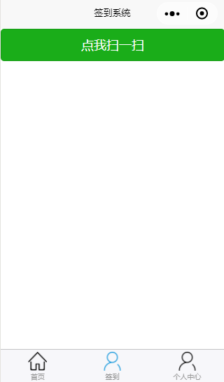

##综合实践报告
###项目概述
该实践项目是开发一个在校学生参加校园活动的应用。
主要功能有：

1. 活动举办方可以在应用管理系统发起活动，生成一个签到二维码 
2. 学生参加活动时通过客户端扫描二维码进行签到。
3. 学生可以通过客户端查看参加过的活动。
4. 学生可以在客户端上查看自己的学号、姓名等详细信息。
###我的职责
我主要负责应用客户端的开发，前期开发微信小程序的客户端功能。后期负责h5页面的客户端开发。
###一、小程序的学习与开发
####微信小程序的目录结构
一开始在网上查找资料，学习微信小程序的开发。
小程序的目录结构：  
  
小程序包含一个描述整体程序的 app 和多个描述各自页面的 page。
一个小程序主体部分由三个文件组成，必须放在项目的根目录，如下：  
  
一个小程序页面由四个文件组成，分别是：  
  
####小程序的页面结构
  
**wxml:**  
功能类似html，描述节点，但小程序的 WXML 用的标签是view，button， text 等等，这些标签就是小程序给开发者包装好的基本能力，还提供了地图、视频、音频等等组件能力。  
**wxss:**  
类似css，有css大部分属性：

1. 单位rpx
2. 样式导入和less等css预处理器一致，用@import
3. 不能用嵌套选择器

**js:**   
微信小程序的 JavaScript 运行环境即不是 Browser 也不是Node.js。它运行在微信 App 的上下文中，不能操作DOM，没有window, document, 也不能通过 Node.js 相关接口访问操作系统 API。  
JS 脚本文件通过改变数据来处理用户的操作  
**json:**  
页面配置文件（可选），比如配置组件、配置下拉刷新功能等。  

####小程序具体功能
小程序主要有三个底部导航按钮组成，在底部的导航栏里互相切换。导航栏里是一个list列表，如果需要增加一个导航按钮，只需要在list列表里添加一个单元，每个单元包含"pagePath"、"text"、"iconPath"、"selectedIconPath"四个信息。  
代码实现：
```
"tabBar": {  
    "list": [  
      {  
        "pagePath": "pages/index/index",  
        "text": "首页",            
        "iconPath": "images/home.png",       
        "selectedIconPath": "images/home@active.png"
      },
      {
        "pagePath": "pages/checkin/checkin",
        "text": "签到",
        "iconPath": "images/person.png",
        "selectedIconPath": "images/person@active.png"
      },
      {
        "pagePath": "pages/userPage/userPage",
        "text": "个人中心",
        "iconPath": "images/person.png",
        "selectedIconPath": "images/person@active.png"
      }
    ]
  },
```

1. 首页-活动中心，有三个按钮，分别是待参加的活动，已参加活动，缺席的活动。  
  
2. 签到-点我扫一扫进行活动签到，点击按钮调用小程序扫一扫组件，进行扫码。  
  
扫码功能主要代码：  
```
click: function () {
    var that = this;
    var show;
    wx.scanCode({
      success: (res) => {
        this.show = "结果:扫码成功,二维码类型:" + res.scanType + "字符集:" + res.charSet + "路径:" + res.path;
        that.setData({
          show: this.show
        })
        wx.showToast({
          title: '成功',
          icon: 'success',
          duration: 2000
        })
      },
      fail: (res) => {
        wx.showToast({
          title: '失败',
          icon: 'success',
          duration: 2000
        })
      },
      complete: (res) => {
      }
    })
  },
```
3. 个人中心-展示用户学号姓名的信息。
###二、H5的学习与开发
H5的功能与微信小程序的功能几乎一样，只是更换了一些样式。首页仍然是展示活动中心，每一行是学生参加一次活动的信息，包括：序号、学号、姓名、班级、年级、手机号。h5底部导航栏也是三个导航按钮，活动记录、签到、个人中心。  
  
活动中心代码：  

`<div id="content">`
    `<table width=100% id="bootstrap-data-table" class="table">`
        `<thead>`  
        `<tr>`  
            `<th class="serial">序号</th>`  
            `<th>学号</th>`  
            `<th>姓名</th>`  
            `<th>班级</th>`  
            `<th>年级</th>`  
            `<th>手机号</th>`  
         `</tr>`  
         `</thead>`
         `<tbody>  
        </tbody>`
    `</table>`  
`</div>`  
底部导航栏代码：  
`<div class="nav">
            <ul>
                <li>
               <a href="../home/index.html"><span></span><span>活动记录</span></a>
                </li>
                <li>
                    <a href="#"><span></span><span>签到</span></a>
                </li>
                <li>
                    <a href="../personal/index.html"><span></span><span>个人中心</span></a>
                </li>
            </ul>
</div>
`  

h5是以页面为单位，包括首页（home文件夹下的index.html），签到（signin文件夹下面的index.html、get_third_party_result.html）,个人中心（personal文件夹下的index.html）。三个index.html都有上面底部导航栏的代码，在当前页面，其标签就是`<a href='#'>`，实现互相切换。  
其中签到页面调用saoyisao的api,扫码成功后将数据回调至http://45.40.199.171:8080/application/wx/view/signin/get_third_party_result.html这个链接。  
具体代码：  
```
	<div id="content">
	<a href="http://sao315.com/w/api/saoyisao?redirect_uri=http://45.40.199.171:8080/application/wx/view/signin/get_third_party_result.html">
    <button>扫描二维码</button>
	</a>
	</div>
```
因此，我们需要再写一个html页面接受回传的数据，即get_third_party_result.html。回传的数据就是二维码上的一个url链接，拿到回传数据，经过去头、去尾等字符串剪切等处理，取得完整的url。再将app上姓名学号等信息，通过url的post请求服务器，服务器获得信息写入数据库，即可签到成功。  
关键代码如下：
```
var qr=getQueryString("qrresult");
    var arr_url = qr.split('?');
    var base_url = arr_url[0];
    var id_str = arr_url[1];
    var id_ = id_str.split('=');
    var id = id_[1];
```
回传数据预处理，获取base_url
```
$.ajax({  
            url: base_url,
            type: "POST",
            data: {
                a2s_act_id:id,
                a2s_stu_name:"林321",
                a2s_stu_num:"111"
            },
            dataType:"json",
            error:function(XMLHttpRequest, textStatus, errorThrown){alert("errorThrown:"+errorThrown)},
            success:function(data) {
                if (data) {
                    var jsonobj=eval("("+data+")");
                    if (jsonobj.code== 1) {
                        alert('签到成功');
                    }
                    else if (jsonobj.code== -1) {
                        alert('签到失败');
                    }
                    else {
                        alert(jsonobj);
                    }
                }
            }
        }); 
```
通过base_url，带着app内的数据请求服务器，实现签到功能  
至此，我的工作基本完成，通过一学期的综合实践，我从一个完全不懂前端的小白，到慢慢学会前端的功能开发，我受益匪浅，更加坚定了我继续从事软件工程的决心。